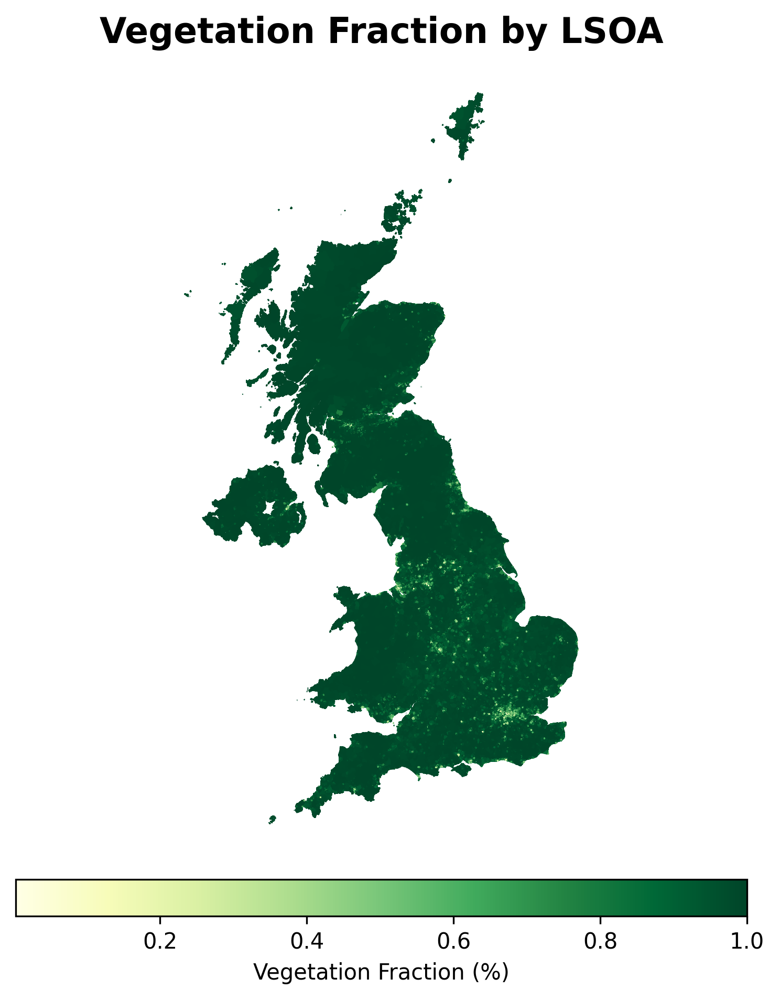

# Sentinel Data Processing


This project processes Sentinel data to calculate vegetation indices and compile statistics for Local Super Output Areas (LSOAs). The output is saved as a Parquet file containing NDVI and EVI statistics for each LSOA.


## 📚 Table of Contents

- [📥 Cloning the Repository](#-cloning-the-repository)
- [📋 Prerequisites](#-prerequisites)
- [⚙️ Setup](#️-setup)
- [📂 Data Files](#-data-files)
- [🔄 Processing Steps](#-processing-steps)
- [🚀 Running the Script](#-running-the-script)
- [📊 Visualizing Results](#-visualizing-results)

## 📥 Cloning the Repository

To clone the repository, use the following command:

```bash
git clone https://github.com/cjber/ndvi.git
cd ndvi
```

## 📋 Prerequisites

- Python 3.8 or higher
- Required Python packages: fastparquet, fiona, gdal, geopandas, ipdb, ipython, mapclassify, matplotlib, polars, pyarrow, pyqt6, rasterio, rtree, tqdm

## ⚙️ Setup

1. Clone the repository and navigate to the project directory.

2. Install the required Python packages using `uv` or `pip`:

   ```bash
   uv sync
   ```

   Alternatively, you can use pip:

   ```bash
   pip install .
   ```

3. Ensure the Sentinel raster data and shapefiles are placed in the appropriate directories as specified in `src/utils.py`.

## 📂 Data Files

- **Raster Data**: Place all Sentinel raster files in the `gisdata/13` directory.
- **Shapefiles**: Ensure the following shapefiles are available:
  - Northern Ireland Data Zones: `gisdata/geography-sdz2021-esri-shapefile.zip`
  - Scottish Data Zones: `gisdata/SG_DataZoneBdry_2022.zip`
  - LSOA Boundaries: `gisdata/Lower_layer_Super_Output_Areas_2021_EW_BFC_V8_8154990398368723939.zip`

## 🔄 Processing Steps

The `src/main.py` uses the following steps to process the Sentinel 2 data.

1. **Read LSOA Boundaries**: The script reads and combines LSOA boundary data from Northern Ireland, Scotland, and England/Wales.

2. **Create R-tree Index**: An R-tree index is created for efficient spatial querying of raster files.

3. **Find Overlapping Rasters**: For each LSOA, the script identifies raster files that overlap with the LSOA geometry.

4. **Process Rasters and Remove Noise**: The script processes each overlapping raster to extract NDVI and EVI values and remove noise:
   - NDVI is calculated using the red and NIR bands.
   - EVI is calculated using the NIR, red, and green bands.
   - NDVI and EVI values are filtered to remove any below -1 and above 1.

5. **Compile Statistics**: For each LSOA, the script compiles statistics such as mean, median, standard deviation, and vegetation fraction for NDVI.

6. **Save Results**: The compiled statistics are saved to a Parquet file (`data/ndvi.parquet`).

## 🚀 Running the Script

### Step 1: Main processing

To run the script and generate the output file, execute:

```bash
python -m src.main
```

### Step 2: 📊 Visualizing Results

After running the script, you can visualize the results using the following command:

```bash
python -m src.demo
```

This will display a plot of the mean Vegetation Fraction for each LSOA.


